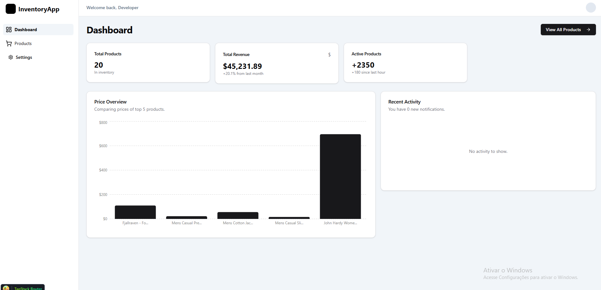

# 📦 Modern Inventory Dashboard

A high-performance, production-ready Inventory Management Dashboard built to master the most modern tools in the React ecosystem. This project focuses on **Type-Safety**, **Server-State Synchronization**, and **Fluid User Experience (UX)**.



## Tech Stack

This project utilizes the "dream stack" for scalable React applications:

- **Framework:** [Vite](https://vitejs.dev/) + [React](https://reactjs.org/) + [TypeScript](https://www.typescriptlang.org/)
- **Routing:** [TanStack Router](https://tanstack.com/router/latest) – Standard-compliant, type-safe file-based routing.
- **Data Fetching:** [TanStack Query](https://tanstack.com/query/latest) – Server-state management, caching, and background synchronization.
- **UI & Styling:** [Shadcn/UI](https://ui.shadcn.com/) + [Tailwind CSS](https://tailwindcss.com/) – Utility-first CSS with accessible, unstyled components.
- **Global State:** [Zustand](https://docs.pmnd.rs/zustand/) – A small, fast, and scalable bearbones state-management solution.
- **Data Visualization:** [Recharts](https://recharts.org/) – Composited, responsive SVG charting library.
- **Animations:** [Framer Motion](https://www.framer.com/motion/) – Declarative animations for micro-interactions and layout transitions.

## Key Features

- **Business Intelligence Dashboard:** Real-time metrics visualization with price-comparison charts using Recharts.
- **Advanced Inventory Management:** Product listing with full CRUD simulation, featuring `loading` (Skeleton UI) and `error` boundary handling.
- **Type-Safe Navigation:** Dynamic product detail routes with parameters validated at compile-time via TanStack Router.
- **Favorite System:** Cross-component state persistence using Zustand to handle global user interactions.
- **Smart Caching:** Automatic background refetching and data synchronization with TanStack Query, significantly reducing server overhead.
- **Declarative UX:** Staggered entry animations and interactive UI feedback powered by Framer Motion.

## Project Structure

Following the **TanStack Router File-based** convention:

```text
src/
├── components/     # Reusable UI components (Shadcn + Custom)
├── lib/            # Utility functions and library configurations
├── routes/         # File-based routing architecture
│   ├── __root.tsx  # Master Layout (Sidebar, Navigation, Shell)
│   ├── index.tsx   # Dashboard Home Page
│   ├── products.tsx # Product Inventory Listing
│   └── products.$productId.tsx # Dynamic Product Detail View
├── store/          # Global State Management (Zustand Stores)
└── main.tsx        # Application entry point & Provider orchestration
```

## Getting Started

1. Clone the repository:
```bash
git clone https://github.com/Rafael19722/dashboard-training.git
```

2. Install dependencies:
```bash
npm install
```

3. Start the development server:
```bash
npm run dev
```

4. View in browser:  
Navigate to http://localhost:5173.

## Technical Refletions & Learnings
This project served as a deep dive into modern frontend architecture, specifically:  

- **Data Orchestration:** Learning to distinguish between **Server State** (handled by TanStack Query) and **Client State** (gandled by Zustand),
ensuring a single source of truth for each data type.
- **Type-Safety at the Edge:** Implementing TanStack Router to ensure that invalid URLs or missing parameters are caught during development rather than at runtime.
- **Performance Optimization:** Utilizing Zustand selectors to prevent unnecessary re-renders and leveraging TanStack Query’s stale-while-revalidate caching strategy.
- **Strategic Adaptation:** Initially explored Anime.js for animations, but pivoted to **Framer Motion** to ensure better compatibility with React’s declarative nature and Vite's ES Module requirements—a decision that improved code maintainability and animation fluidness.

Developed with ❤️ by Rafael Rangel.